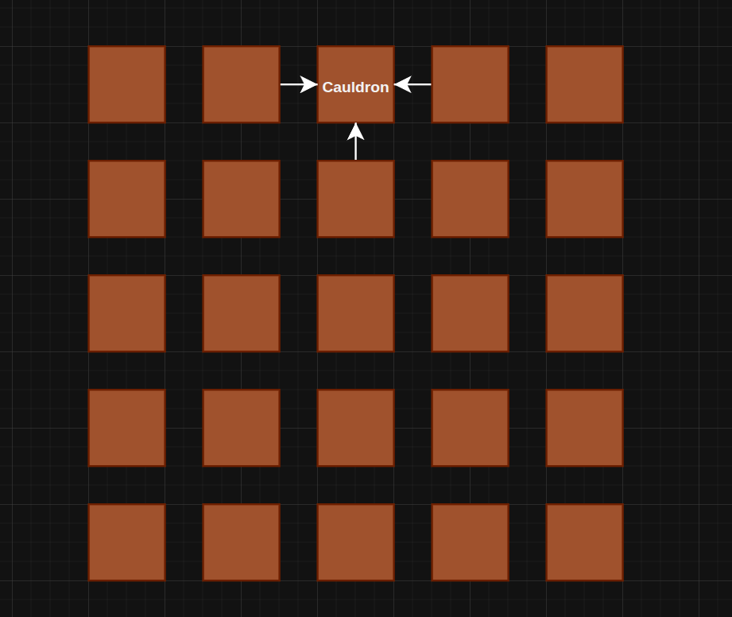
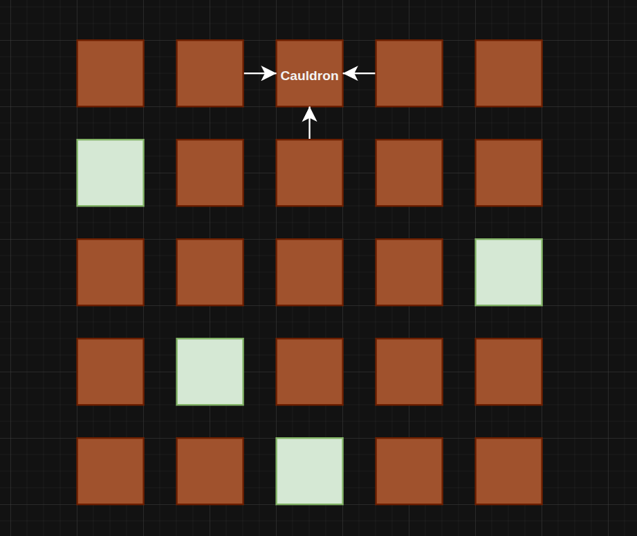
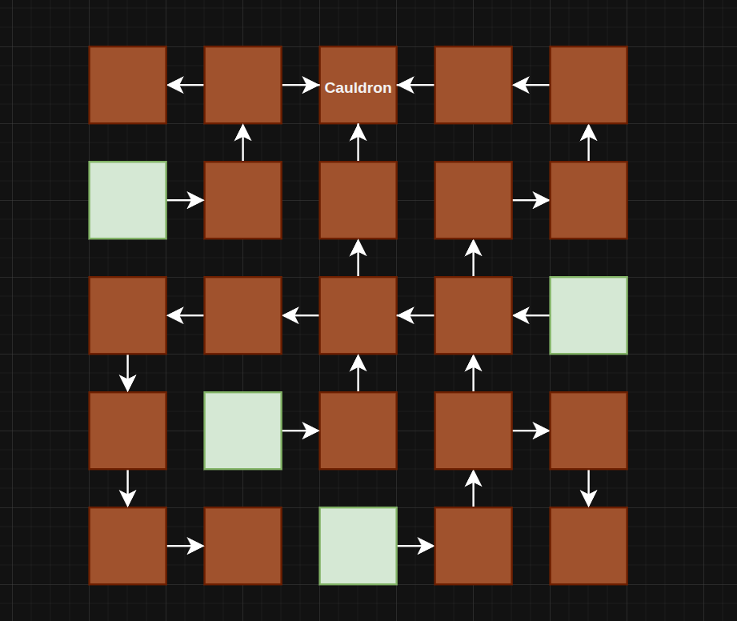
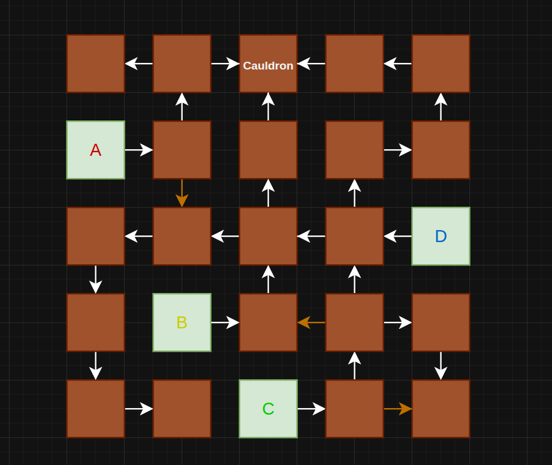
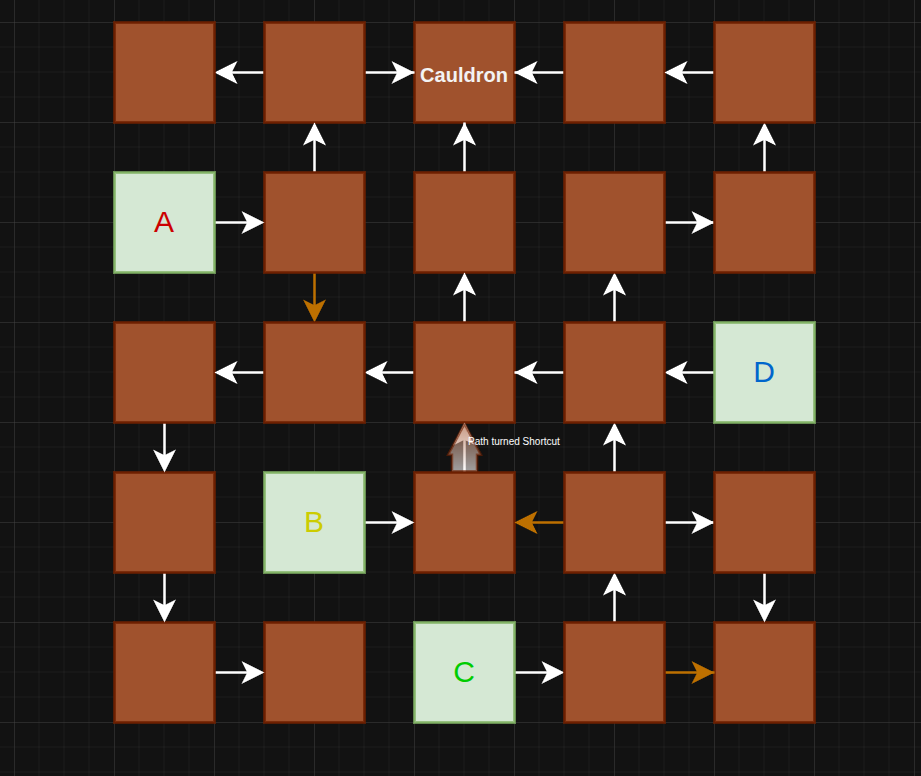

# Silt's (Ruslan's) dev blog for DH2650

This page is going to document my own contributions for the game design course at KTH with the course code DH2650 (make a ink here).

---

## 2026-03-25 - First meeting

I booked the group's first meeting, where we spent a lot of time talking about our interests, what games we've played, and such. It took some time, but eventually all of the group members began opening up about their experiences :) This lead to a wonderful brainstorming session where we finally came up with our game idea! We used Figma to brainstorm, which included writing down all kinds of ideas until we found something that we really wanted to refine. It makes me really glad that I'm in this project with two interaction design students, since they're very familiar with brainstorming and the creative process.

## 2026-03-30 - Personal Reflections

I think the hardest part of game development in groups is _alignment_, for lack of a less corporate-sounding word. Each member has their own idea for how this game will look and feel, even though we use the same language to describe it. The most important part right now is to bridge our respective gaps and work towards a shared mythos of what our game is supposed to be.

It's kinda nice that we use Figjam for so much of this. It lets us share ideas and structure them in a non-linear fashion. I've written down my own ideas for the game, and it seems like my team has done the same! I am excited to meet today and finally start working on some tangible stuff.

### Making a Multiplayer Game

After doing a short research session about making a multiplayer game, I have come to the conclusion that it would be best to make a client-hosted Unity game. Godot's multiplayer solutions just cannot hold up to Unity as of now, as much as I would love to work in Godot. There's some thing called Relay I think? We can host our game through that I think. I will have to do some more research into that.

### Dump from personal notes
Give more depth to the potion system:
- The cauldron has a simple “cook” mechanic. Ingredients inside are cooked. Then, by holding a bottle and interacting with the cauldron again, you fill the bottle with an elixir. 
- Some Ingredients need different amounts of cooking time for their effect to materialize. If certain ingredients are overcooked, it might result in a terrible reaction. 
	- Example #1: Gunpowder only needs to be cooked once to have an effect. However, if gunpowder is cooked together with cinders, it will cause the cauldron to explode.
	- Example #2: Red cap mushrooms need to be cooked thrice in transmit its enlarging effect. Otherwise it acts as a poison that puts you to sleep. 
- Rename gunpowder to Sulfur. 
- **Reason for adding this:** It gives potion crafting more depth, and creates unpredictability, which I feel is at the core of wizardry.

#### Game design pillars
Ranked from Most Important to Least Important, but all are vital. 
##### Crafting 
- Alchemy is all about making a concoctions to solve problems! Crafting should be integral to the gameplay loop. 
##### Chaotic 
- Alchemy and Wizardry is often unpredictable, and this should be reflected in our potion crafting & environment design. Let actions have consequences that teach the players what to do & not do. 
##### Social
- Players work towards a common goal and their decisions should impact each other, whether they are working towards that common goal or not. 

## 2026-03-31

We had a hybrid meeting where we discussed some question marks regarding game design. I setup a Github Repo with a Gtihub Projects attached to it. I also put up some issues on our KanBan board, I'm hoping people will use it! 

I told the group that I'd be down to do the elevator pitch & presentation essentially solo, Lugina has helped out a tonne with the business case however, so thats nice :) Aside from that, Yufan has made plenty of sketches that I can use in the presentation, so I have some good material to show during the presentation 

## 2026-04-01

Happy April Fools!

I've more or less finished making the slides for the presentation tomorrow. I feel like freestyling it a little. It sucks that we haven't started writing anything in the GDD yet, I wish our lead Game Designer would've written down the base mechanics at least. Currently it's still all up in the air so i suppose whatever I present tomorrow is what I *think* the group thinks we are making. Either way, I think it will be fruitful.

I want to start coding on this project so I can learn how multiplayer game development works. I want to ask if there are any good resources for it so I can save time on researching. 

## 2026-04-04 - 2026-04-06

Ok so quick recap for these past three days! I've managed to make multiplayer for in Unity, I just need to test if my solution works remotely. With that said, I think I have a firm grasp of Netcode for GameObjects now, so I should be able to easily convert anything my team makes into viable multiplayer code.

Aside from that, on April 6th, we held a group meeting where we wrote down the concrete goals for our Prototype, I then divvied up the work. I also finally began editing the GDD, being the first and so far only person to start writing stuff down in it hahah. It's not a big deal though, since we use our Figma as the living document, while the GDD is just the formalized version of it.

## 2026-04-13

I haven't been writing much in this blog, because i've been doing lots of work on the project. Namely, I have been devising how to do random map generation, and with Björn's dissuation, I've decided it to be outside of the scope of the project. Here it is anyway: 

### Random Generation

Suppose we have a NxN grid that represents the game world. The Cauldron will spawn at a set location on this game world, and the cauldron room will always have three doorways leading to it. 

Now, Randomly Assign Four Gardens on the grid, these are not allowed to be directly next to the Cauldron.

Then, do a [[DFS properties|DFS]] search with a randomly chosen direction from each garden towards the Cauldron as the end location. The only limitation is that the DFS is not allowed to go to a Garden Node. DFS is allowed to visit nodes that have already been visited, but it is not allowed to go through a connection that has already been walked through. 

Then, Assign each Garden an Ingredient and assign a Shortcut Path at a few randomly chosen and unassigned Paths, and also at one previously assigned path (but never directly to a garden). Shortcuts are paths that can be unlocked by either setting an obstacle on fire and/or blowing it up

And now randomly assign different room prefabs to the unclaimed tiles! There are some rules to this however: 
- First, each room is assigned two values: **Difficulty** and **Number of Exits (NoE)**. 
	- Difficulty basically means how hard the room is to pass through. It’s a heuristic for map creation, ranging from integers 0 through 2. Room prefabs will have a Difficulty rating attached to them, which the generator uses to assign prefab rooms. Difficulty is assigned with Perlin noise, where values assign the following difficulty: 
		- $mat(0,0.4)$ : 0
			- 0: Players can pass through without any tools to help whatsoever, even if miasma would occupy half of the room. 
		- $mat(0.4, 0.8)$ : 1
			- 1: Players don’t need tools to pass through, assuming no Miasma occupies the room.
		- $mat(0.8, 1)$ : 2
			- 2: Players will need tools to pass through, assuming no miasma is present
- Second, we go through each tile and assign it a room based on Difficulty and NoE, with NoE taking priority over Difficulty. If a a specific Difficulty-NoE configuration exists, it will pick the next possible room with matching NoE and closest match Difficulty. 
- Thirdly, in paths where we have marked shortcuts, we put an obstacle in the way. Obstacles can come in three flavors and are chosen at random: 
	- Flammable Obstacle: Ignite it to clear it. 
	- Breakable Obstacle: Explode it to clear it.
	- Vertical Obstacle: A high wall blocks the path. Find some way to scale it.

That’s it! You now have a fully-generated game map. It will require the following minimum prefabs however:
- Atleast one room prefab for every NoE configuration.
	- 1 NoE: 1 room prefab $times$ 4 rotations. 
	- 2 NoE: 2 room prefabs $times$ 2 rotations.
	- 3 NoE: 1 room prefab $times$ 2 rotations. 
	- 4 NoE: 1 room prefab

I am starting to think that it might be better if we have separate prefabs for walls with their NoE, and a set of prefabs for the difficulty. 
